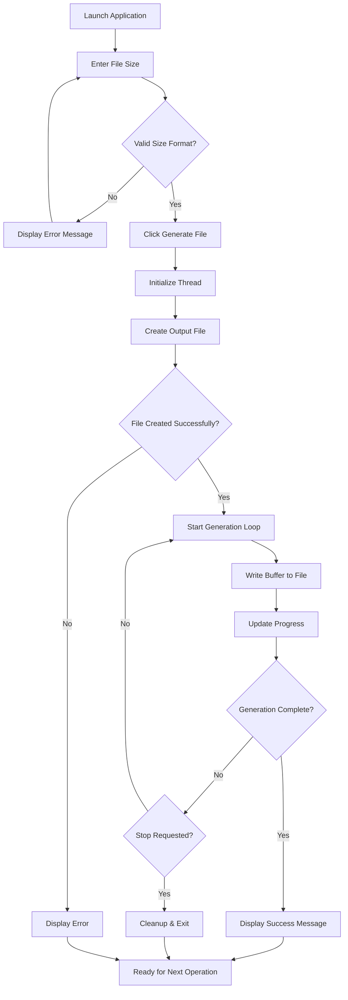
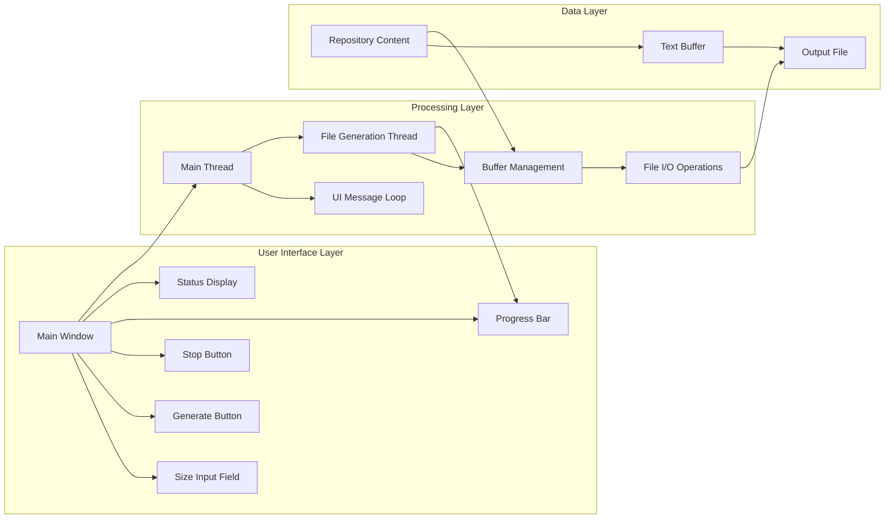

# xsukax File Generator


A lightweight, high-performance Windows application designed for generating files of specified sizes filled with comprehensive information you choose.

## Project Overview

The xsukax File Generator is a native Windows C++ application that creates text files of user-defined sizes containing information you choose. This tool serves multiple purposes including testing disk performance, generating sample data, creating documentation archives, and showcasing project information in a structured format.

The application features a clean, intuitive graphical user interface built using native Windows controls, ensuring optimal performance and system integration. It operates entirely offline, requiring no internet connectivity or external dependencies, making it ideal for secure environments and air-gapped systems.

## Security and Privacy Benefits

### **Data Privacy Protection**
- **Zero Network Activity**: The application operates completely offline with no network connections, ensuring that no user data or system information is transmitted externally
- **No Data Collection**: The application does not collect, store, or transmit any personal information, usage statistics, or system metadata
- **Local Processing Only**: All file generation occurs locally on the user's machine without any cloud dependencies or remote services

### **System Security Features**
- **Minimal Permissions**: Requires only standard user-level file system access permissions
- **No Registry Modifications**: Does not alter Windows registry entries or system configurations
- **Memory Safe Operations**: Implements modern C++ practices with smart pointers and bounds checking to prevent buffer overflows
- **Thread Safety**: Uses atomic operations and proper synchronization to prevent race conditions and ensure stable operation

### **File System Security**
- **Controlled File Creation**: Generates files only in the current working directory with predictable, timestamped naming conventions
- **Safe Cleanup**: Automatically removes incomplete files if the generation process is interrupted
- **Permission Validation**: Includes comprehensive error handling for file permission and disk space issues

## Features and Advantages

### **Core Functionality**
- **Flexible Size Specification**: Supports multiple unit formats (B, KB, MB, GB, TB) with precise size calculation
- **High-Performance Generation**: Utilizes optimized 16MB buffer operations for maximum write speeds
- **Real-Time Progress Tracking**: Displays completion percentage and current write speed (MB/s)
- **Graceful Interruption**: Allows users to stop file generation at any time with proper cleanup

### **User Experience**
- **Native Windows Integration**: Built with Windows API for optimal performance and system compatibility
- **Minimal Resource Usage**: Efficient memory management with controlled buffer allocation
- **Responsive Interface**: Multi-threaded architecture prevents UI freezing during file operations
- **Automatic Filename Generation**: Creates unique filenames with timestamp precision to avoid conflicts

### **Technical Advantages**
- **Zero Dependencies**: No external libraries or runtime requirements beyond Windows system libraries
- **Unicode Support**: Full Unicode compatibility for international character sets
- **Error Resilience**: Comprehensive error handling with user-friendly status messages
- **Memory Efficient**: Uses streaming operations to handle files larger than available RAM

## Installation Instructions

### **System Requirements**
- **Operating System**: Windows 10 or Windows 11 (64-bit recommended)
- **Architecture**: x86 or x64
- **Memory**: Minimum 100MB available RAM
- **Disk Space**: Variable based on intended file generation sizes
- **Permissions**: Standard user account with file write access

### **Installation Steps**

#### **Option 1: Download Pre-compiled Binary**
1. Navigate to the [Releases](../../releases) section of this repository
2. Download the latest `xsukax_filegen.exe` binary
3. Save the executable to your desired location
4. No additional installation steps required

#### **Option 2: Build from Source**
1. **Prerequisites Setup**
   ```bash
   # Ensure you have Visual Studio 2019 or later with C++ build tools
   # Or MinGW-w64 compiler suite
   ```

2. **Clone Repository**
   ```bash
   git clone https://github.com/xsukax/xsukax-File-Generator-Based-On-Size.git
   cd xsukax-File-Generator-Based-On-Size
   ```

3. **Compile Application**
   
   **Using Visual Studio:**
   ```bash
   # Open Developer Command Prompt
   cl /EHsc /std:c++17 xsukax_filegen.cpp /link user32.lib gdi32.lib comctl32.lib
   ```
   
   **Using MinGW:**
   ```bash
   g++ -std=c++17 -O2 -DUNICODE -D_UNICODE -mwindows -o xsukax_filegen.exe xsukax_filegen.cpp -lcomctl32 -lgdi32 -luser32 -lkernel32
   ```

4. **Verify Installation**
   ```bash
   # Run the executable to ensure proper compilation
   ./xsukax_filegen.exe
   ```

## Usage Guide

### **Basic Operation Workflow**



### **Step-by-Step Instructions**

#### **1. Starting the Application**
- Double-click `xsukax_filegen.exe` to launch the application
- The main window will display with a simple, intuitive interface

#### **2. Specifying File Size**
- Enter the desired file size in the text field using the following formats:
  - **Bytes**: `1024` or `1024B`
  - **Kilobytes**: `500KB`
  - **Megabytes**: `100MB`
  - **Gigabytes**: `2GB`
  - **Terabytes**: `1TB`

#### **3. Generating Files**
- Click the **"Generate File"** button to begin the process
- Monitor progress through the real-time progress bar
- Observe generation speed in the status display
- Use the **"Stop"** button to halt generation if needed

#### **4. Output Management**
- Generated files are saved in the application's directory
- Filenames follow the pattern: `xsukax_output_YYYYMMDD_HHMMSS_mmm.txt`
- Files contain repeated information about anything you choose

### **Application Architecture**



### **Performance Optimization Tips**

- **Large Files**: For files exceeding 1GB, ensure sufficient free disk space (at least 110% of target file size)
- **SSD Performance**: Running on SSD storage will significantly improve generation speeds
- **System Resources**: Close unnecessary applications to maximize available memory and CPU resources
- **Antivirus**: Temporarily disable real-time scanning for faster write operations (remember to re-enable)

### **Troubleshooting Common Issues**

| Issue | Cause | Solution |
|-------|-------|----------|
| "Failed to create file" | Insufficient permissions | Run as administrator or choose different directory |
| "Write failed" | Disk space exhausted | Free up disk space or choose smaller file size |
| Slow generation speed | High system load | Close other applications and retry |
| Application not starting | Missing dependencies | Ensure Windows system libraries are up to date |

## Licensing Information

This project is licensed under the **GNU General Public License v3.0** (GPL-3.0). This license ensures that the software remains free and open-source while protecting both users and contributors.

### **What GPL-3.0 Means for You**

#### **For Users:**
- **Freedom to Use**: You can run the program for any purpose without restrictions
- **Freedom to Study**: You have access to the complete source code to understand how it works
- **Freedom to Share**: You can redistribute copies to help others
- **Freedom to Improve**: You can modify the software and share your improvements

#### **For Contributors:**
- **Copyleft Protection**: All derivative works must also be licensed under GPL-3.0
- **Patent Grant**: Contributors provide an implicit patent license for their contributions
- **Attribution Requirements**: Original authorship must be preserved in all distributions
- **Source Code Availability**: Any distributed binaries must include or offer access to source code

#### **Key Obligations:**
- If you distribute this software (modified or unmodified), you must include the GPL-3.0 license
- If you modify and distribute the software, you must make your changes available under the same license
- You cannot impose additional restrictions beyond those in the GPL-3.0

### **License Compatibility**
The GPL-3.0 license is compatible with most other open-source licenses but may not be suitable for proprietary commercial projects. For detailed information about license compatibility and obligations, please refer to the [official GPL-3.0 license text](LICENSE).

---

## Contributing

We welcome contributions to improve the xsukax File Generator.

## Support

For bug reports, feature requests, or general questions, please use the [GitHub Issues](../../issues) page. We strive to respond to all inquiries within 48 hours.

## Acknowledgments

This project showcases xsukax's commitment to creating practical, secure, and efficient Windows utilities. The application serves as both a useful tool and a demonstration of modern C++ development practices for Windows desktop applications.

---

**Developed by xsukax** | [Website](https://xsukax.com) | [GitHub](https://github.com/xsukax) | [Mastodon](https://infosec.exchange/@xsukax)
